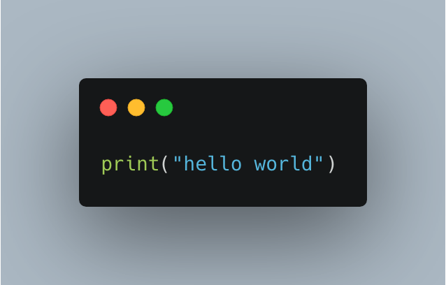
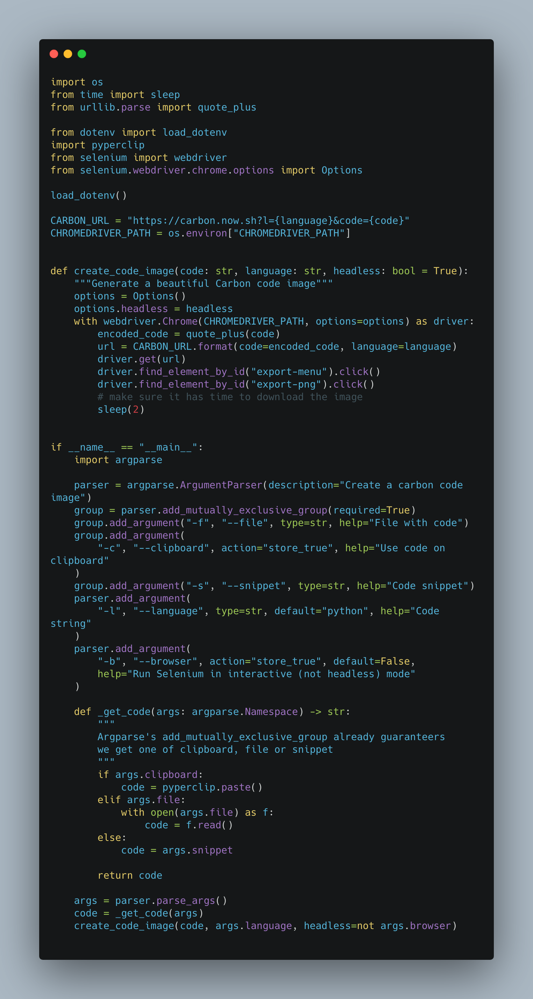
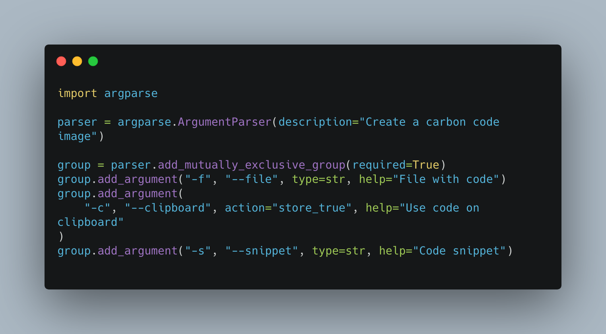

# Carbon Selenium

A small utility to generate beautiful code images using [the awesome _carbon_ service](https://carbon.now.sh/).

You can load in code from a file, the clipboard or a snippet:

```
$ python script.py -h
usage: script.py [-h] (-f FILE | -c | -s SNIPPET) [-l LANGUAGE] [-b]

Create a carbon code image

optional arguments:
  -h, --help            show this help message and exit
  -f FILE, --file FILE  File with code
  -c, --clipboard       Use code on clipboard
  -s SNIPPET, --snippet SNIPPET
                        Code snippet
  -l LANGUAGE, --language LANGUAGE
                        Programming language
  -b, --browser         Run Selenium in interactive (not headless) mode
```

Examples:

1. Make a hello world snippet carbon image:

	```
	$ python script.py -s 'print("hello world")'
	```

	Resulting image:

	

2. Make a code image of a file, let's pick a [FastAPI](https://fastapi.tiangolo.com/) app I am working on:

	```
	$ cat /Users/bbelderbos/code/infinite-scroll/main.py
	from fastapi import FastAPI, Query
	from sqlmodel import select, Session

	from youtube.models import YouTube, YouTubeRead
	from youtube.db import engine

	app = FastAPI()


	@app.get("/videos/", response_model=list[YouTubeRead])
	def read_videos(offset: int = 0, limit: int = Query(default=100, lte=100)):
		with Session(engine) as session:
			videos = session.exec(
				select(YouTube).offset(offset).limit(limit)
			).all()
			return videos
	```

	Run the script with the `-f` option:

	```
	python script.py -f /Users/bbelderbos/code/infinite-scroll/main.py
	```

	Resulting image:

	

3. Copying the following lines to the clipboard:

	Here is my favorite feature: make an image from code I currently have on my OS clipboard (thanks `pyperclip`):

	Try it out, copy this code:

	```
	from time import sleep

	sleep(2)
	```

	Then run the script with `-c`:

	```
	$ python script.py -c
	```

	Resulting image:

	

## Setup

Make a virtual environment and install the `requirements.txt` file.

Download the [ChromeDriver](https://chromedriver.chromium.org/), and extract it in a folder, then set it's full path in `.env`, for example:

```
echo "CHROMEDRIVER_PATH=/Users/bbelderbos/bin/chromedriver" > .env
```

The script uses Selenium in headless mode, the resulting `carbon.png` will be downloaded to the folder you run the script from.

---

Enjoy and feel free to mention [me](https://twitter.com/bbelderbos) or [PyBites](https://twitter.com/pybites) when you post one of the created images on Twitter. Also make sure you follow us to receive multiple Python tips every week (using these images).

Future plans / TODOs:

- Create a [PyBites YouTube training video](https://www.youtube.com/channel/UCBn-uKDGsRBfcB0lQeOB_gA) about the code (`selenium` and `argparse`).

- Support passing other font types and background colors so we can also use it for [PyBites Career and Mindset tips](https://codechalleng.es/tips).

- Could build an API service around this ...
