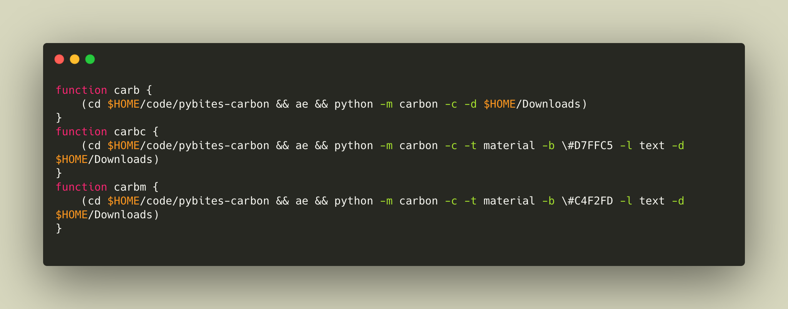

# PyBites Carbon

A small utility to generate beautiful code images using [the awesome _carbon_ service](https://carbon.now.sh/).

You can get it from PyPI:

```
pip install pybites-carbon
```

You can load in code from a file, the clipboard or a snippet:

```
usage: carbon [-h] (-f FILE | -c | -s SNIPPET) [-i] [-l LANGUAGE] [-b BACKGROUND] [-t THEME] [-d DESTINATION]

Create a carbon code image

optional arguments:
  -h, --help            show this help message and exit
  -f FILE, --file FILE  File with code
  -c, --clipboard       Use code on clipboard
  -s SNIPPET, --snippet SNIPPET
                        Code snippet
  -i, --interactive     Run Selenium in interactive (not headless) mode
  -l LANGUAGE, --language LANGUAGE
                        Programming language
  -b BACKGROUND, --background BACKGROUND
                        Background color
  -t THEME, --theme THEME
                        Name of the theme
  -d DESTINATION, --destination DESTINATION
                        Specify folder where image should be stored (defaults to current directory)
```

You need to download the [ChromeDriver](https://chromedriver.chromium.org/) and make it available in your environment, for example:

```
export CHROMEDRIVER_PATH=$HOME/bin/chromedriver
```

To run this automatically upon starting a new shell, add this line to your `.zshrc` or `.bashrc`.

Examples using the tool:

1. Make a hello world snippet carbon image:

	```
	$ carbon -s 'print("hello world")'
	```

	Resulting image:

	

2. Make a code image of a file, let's pick a [FastAPI](https://fastapi.tiangolo.com/) app I am working on:

	```
	$ cat $HOME/code/infinite-scroll/main.py
	from fastapi import FastAPI, Query
	from sqlmodel import select, Session

	from youtube.models import YouTube, YouTubeRead
	from youtube.db import engine

	app = FastAPI()


	@app.get("/videos/", response_model=list[YouTubeRead])
	def read_videos(offset: int = 0, limit: int = Query(default=100, lte=100)):
		with Session(engine) as session:
			videos = session.exec(
				select(YouTube).offset(offset).limit(limit)
			).all()
			return videos
	```

	Run the script with the `-f` option:

	```
	carbon -f $HOME/code/infinite-scroll/main.py
	```

	Resulting image:

	

3. Copying the following lines to the clipboard:

	Here is my favorite feature: make an image from code I currently have on my OS clipboard (thanks [`pyperclip`](https://pypi.org/project/pyperclip/)):

	Try it out, copy this code:

	```
	from time import sleep

	sleep(2)
	```

	Then run the script with `-c`:

	```
	$ carbon -c
	```

	Resulting image:

	

I added some aliases to my `.zshrc` to make it even easier (last two are for [our career and mindset tips](https://codechalleng.es/tips))



(Image created with this tool: `carbon -c -l application/x-sh -t monokai -b #D7D7BE`)

## Developer setup

Make a virtual environment and install the `requirements-dev.txt` file or just run `make setup`.

Download the [ChromeDriver](https://chromedriver.chromium.org/), and extract it in a folder, then set it's full path in `.env`, for example:

```
echo "CHROMEDRIVER_PATH=$HOME/bin/chromedriver" > .env
```

If you have a slow internet connection you can optionally internet connection you can optionally set `SECONDS_SLEEP_BEFORE_DOWNLOAD` to a value higher than the default `3`:

```
echo "SECONDS_SLEEP_BEFORE_DOWNLOAD=10" >> .env
```

(`>>` means append (not override) to an existing file)

The script uses Selenium in _headless mode_. The resulting `carbon.png` image will be downloaded to your computer or to a different directory specified with `-d` (or `--destination`).

To run the tests, type `pytest` or `make test`.

---

Enjoy and feel free to mention [me](https://twitter.com/bbelderbos) or [PyBites](https://twitter.com/pybites) when you post one of the created images on Twitter. Also make sure you follow us to receive multiple Python tips every week (using these images).
